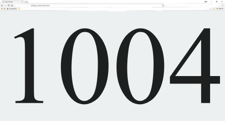

# BigCounter

Full Screen Counter

Show fullscreen counter on the html web page.

## Usage

### KEYBOARD & MOUSE

| What | keyboard & Mouse  |
|---|---|
| Increment | Any key or click |
| Decrement | Minus sign or backspace |
| Reset zero | 0 or ESC |
| Toggle full screen | s, S or double click |
| Change background color | b, B |
| Change font | f, F |
| Help | h, H |

## Screenshot

## Demo

[BigCounter Demo 1](https://kimhongil.github.io/BigCounter/)

[BigCounter Demo 2 (Clickable)](http://hongil.kim/BigCounter/)

## Based on

[BrOrlandi/big-text.js](https://github.com/BrOrlandi/big-text.js)

[qinst64/html-big-text](https://github.com/qinst64/html-big-text)

[tommoor/fontselect-jquery-plugin](http://github.com/tommoor/fontselect-jquery-plugin)

## License

This project is released under the MIT license.